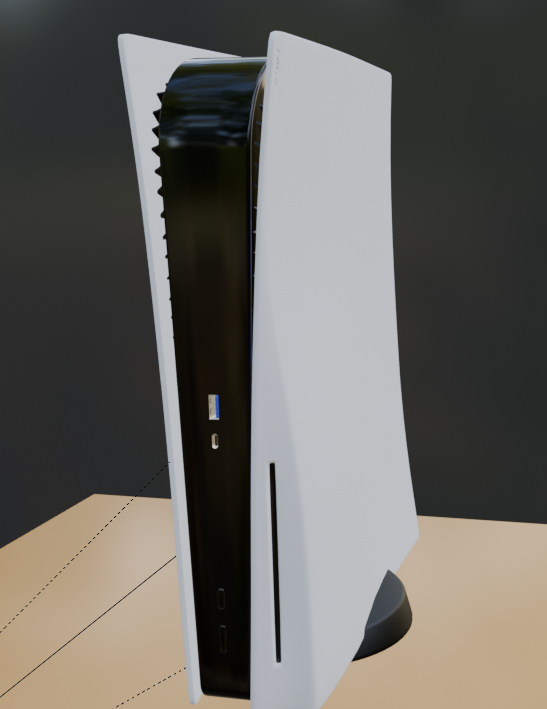
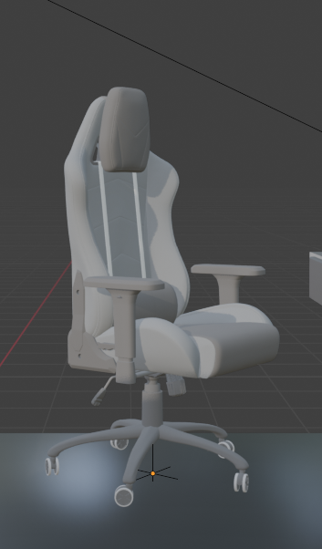
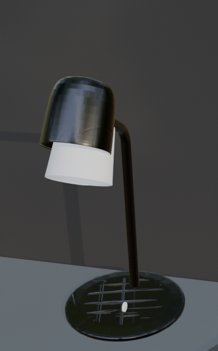

# 🚀 Interactive 3D Developer Portfolio

<div align="center">
  
  
  
  
  
</div>

<br>

A modern, highly interactive, and responsive developer portfolio featuring a custom 3D isometric room. Built from the ground up using core web technologies and Google's `<model-viewer>` for robust WebGL rendering.

## ✨ Key Features

- **Interactive 3D Viewport**: Seamlessly integrated `.glb` 3D model exported from Blender with Draco compression.
- **Full Camera Controls**: Users can intuitively rotate, pan, and zoom around the 3D space.
- **Dynamic Theme Toggling**: Built-in Light/Dark mode switcher with smooth CSS transitions.
- **Responsive Layout**: Designed to look stunning on both mobile devices and large desktop monitors.
- **Advanced Loading State**: Custom UI progress bar and robust error handling for heavy 3D assets.

## 🛋️ 3D Models & Composition

The central piece of this portfolio is an **Isometric Room** meticulously assembled in Blender. To bring the room to life and give it a true developer/gamer aesthetic, the following external 3D assets were imported and integrated into the final scene:

| 3D Model | Preview |
| :--- | :---: |
| **PS5 Controller** |  |
| **PS5 Console** |  |
| **Gaming Chair** |  |
| **Desk Lamp** |  |

## 🛠️ Technologies & Tools

- **Frontend Core**: Vanilla HTML5, CSS3, JavaScript (ES6+).
- **3D Rendering**: `@google/model-viewer` for optimized, responsive, and fallback-safe 3D rendering.
- **3D Modeling**: Blender (Exported to `.glb` using Draco Mesh Compression & JPEG textures to bypass GitHub limits).

## 🚀 Local Development Setup

Because this project fetches heavy 3D assets dynamically, it **cannot** be opened directly via the file system (`file:///...`) due to strict browser CORS security policies. You must use a local web server.

### Prerequisites
- [Visual Studio Code](https://code.visualstudio.com/)
- [Live Server Extension](https://marketplace.visualstudio.com/items?itemName=ritwickdey.LiveServer)

### Running the project
1. Clone the repository:
   ```bash
   git clone https://github.com/GalavizMedinaAA04/Proyecto-Final.git
   ```
2. Open the cloned folder in VS Code.
3. Right-click on `index.html` and select **"Open with Live Server"**.
4. Your default browser will automatically open at `http://127.0.0.1:5500` and the 3D model will begin loading.

## 👨‍💻 About the Author

**Aldebarán Antonino Galaviz Medina**  
*Computer Systems Engineering Student*

Passionate about building interactive web experiences and robust applications. Besides programming, my passions include playing chess, sports, and I have a strong drive for winning.

📫 **Contact**: aldebaran@gmail.com | [Instagram](https://instagram.com/galavizaldebaran)

---
<div align="center">
  <i>Designed and developed as a Computer Graphics Final Project.</i>
</div>
